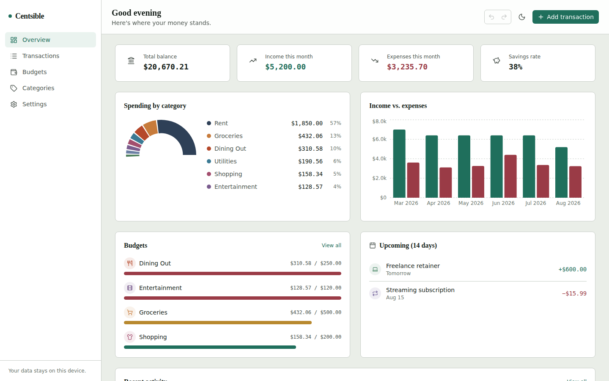
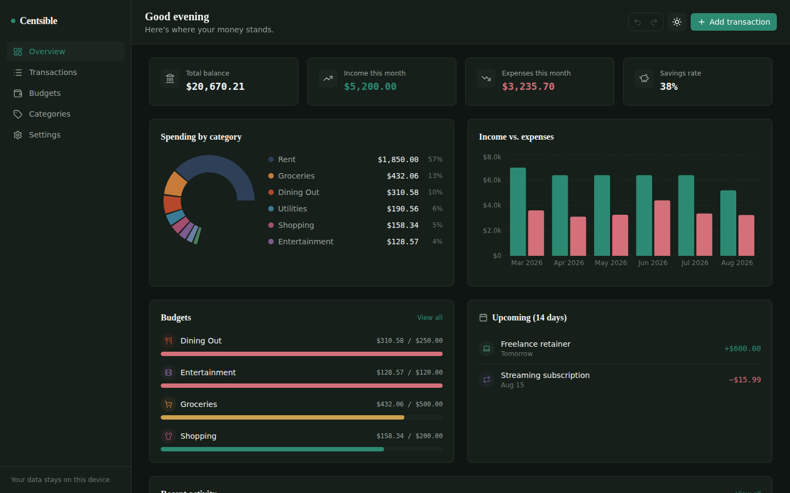
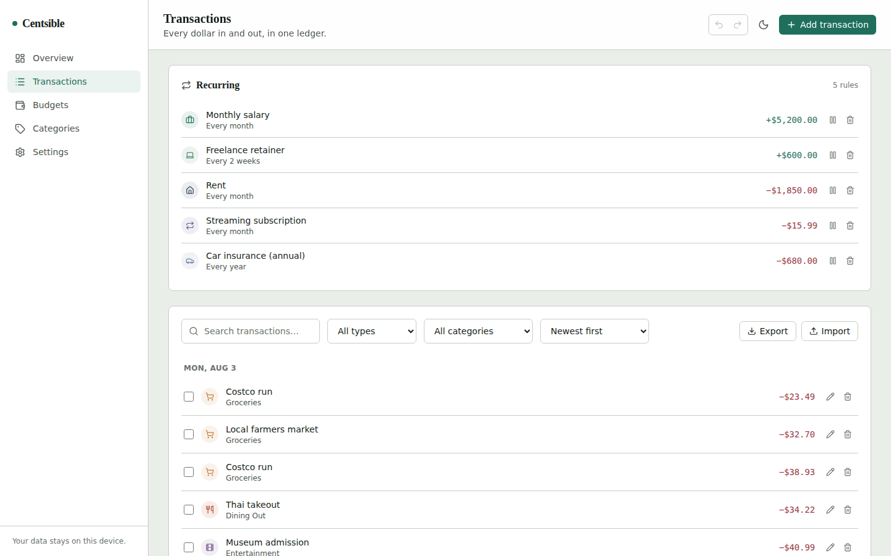
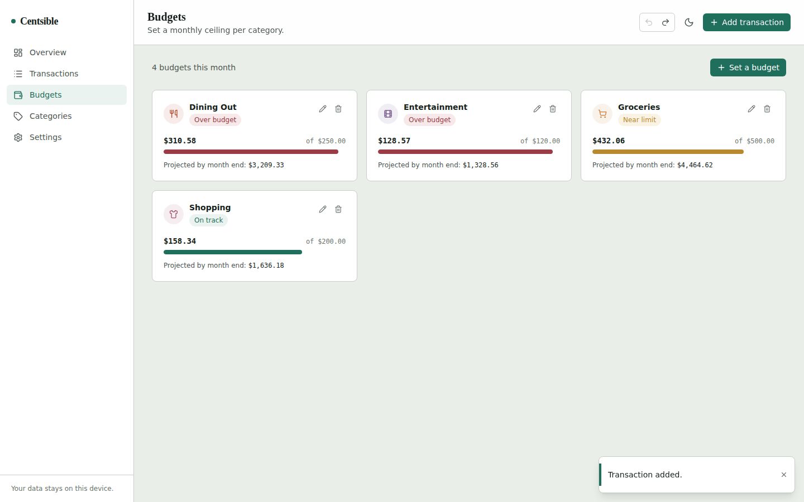
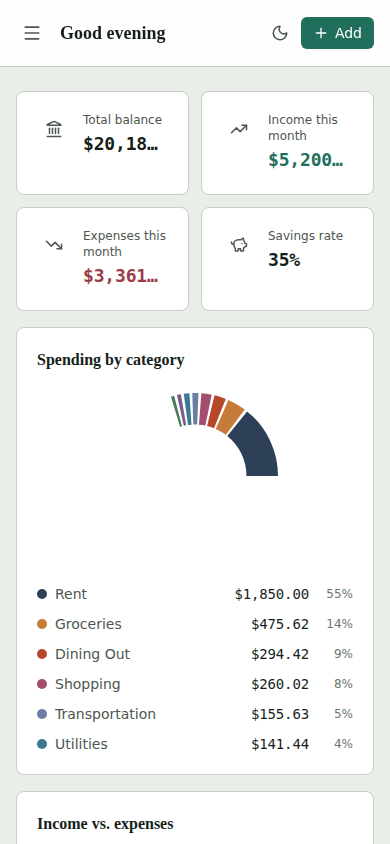

# Centsible

**A personal finance dashboard with a hand-built recurring-transaction engine, budget projections, and real undo/redo.**


> ⚠️ **Repositório disponibilizado apenas para portfólio.** O código pode
> ser visualizado, mas **não** pode ser copiado, baixado, usado ou
> reaproveitado em outros projetos. Veja a seção [License](#license) e o
> arquivo [`LICENSE`](./LICENSE).



## Overview

Centsible is an expense tracker — a genre with a thousand tutorial clones — built to actually behave like one. Set up "Rent, monthly, on the 1st" once and it keeps posting itself, correctly, forever (including the part where "the 31st of every month" doesn't exist in February). Set a grocery budget and it doesn't just show a bar, it tells you where you're *trending* to land by the end of the month. Delete a transaction by mistake and you get a real Ctrl+Z, not a confirmation dialog.

Everything runs client-side (React + TypeScript + Vite) with data in `localStorage` — no backend, no signup, clone and run.

## Features

- **Recurring transactions** — daily / weekly / monthly / yearly, any interval ("every 2 weeks"), optional end date. Past-due occurrences auto-post on load, like a bank posting a bill; upcoming ones show in a 14-day preview.
- **Budgets with a projection, not just a bar** — linear end-of-month spend forecast based on your pace so far this month, with under / near-limit / over states.
- **Undo/redo** — a generic history stack over every data-changing action (`Ctrl+Z` / `Ctrl+Shift+Z`), plus inline "Undo" on delete toasts.
- **CSV import & export** — hand-rolled parser (quoted fields, embedded commas/quotes/newlines), with flexible import that infers income/expense from a signed amount if there's no explicit type column.
- **Dashboard** — category breakdown, 6-month income vs. expense trend, budget progress, upcoming bills, recent activity.
- **Custom categories** — name, color, icon, and whether they apply to income, expenses, or both.
- **JSON backup / restore**, CSV export, dark mode, multi-currency formatting (USD/EUR/GBP/BRL/JPY/CAD/AUD), fully responsive down to a 390px viewport.
- Seeded with **six months of realistic demo data** on first run, so the dashboard is never empty.

## Technical highlights

The brief for this project was "pick something everyday, make the complexity earn its place." These are the parts that do:

- **A hand-written recurrence engine** (`src/domain/recurrence.ts`), not a date library. The hard part isn't "add N days" — it's that anchoring a monthly rule to *the previous occurrence* silently breaks: "the 31st" clamps to Feb 28, and a naive implementation then keeps recurring on the 28th forever instead of returning to the 31st in March. This engine always computes each occurrence as an offset from the *original* start date, so Jan 31 → Feb 28 → Mar 31 → Apr 30, correctly, including leap years. It's the single most-tested file in the repo.
- **Money as integer cents, everywhere.** `amountCents: 4599`, never `amount: 45.99`. No floating-point drift, ever. Conversion to/from a decimal string happens at exactly two boundary functions (`domain/money.ts`).
- **A generic undo/redo reducer enhancer** (`src/store/undoable.ts`) — a `{ past, present, future }` wrapper around *any* `(state, action) => state` reducer, in the spirit of `redux-undo` but dependency-free and ~60 lines. It doesn't know what a "transaction" is.
- **Cascading, integrity-preserving deletes.** Delete a category and its transactions and recurring rules reassign to "Other" rather than pointing at a category that no longer exists; any budget tied to it is removed rather than left orphaned. See the `DELETE_CATEGORY` reducer case and its tests.
- **A localStorage schema with a version number and a migration chain**, not a bare `JSON.stringify(state)`. There's exactly one schema version today, but the shape means "add a field" becomes "bump the version and add a migration function," not a breaking change for existing users.
- **Memoized, framework-agnostic selectors** (`src/store/selectors.ts`) for dashboard aggregation — pure functions, independently unit-tested, wrapped in `useMemo` only at the point of use in components.
- **Route-level code-splitting.** Recharts alone pushed the initial bundle past Vite's 500 kB warning threshold; `React.lazy` + `Suspense` per route dropped the main chunk from **682 kB to 234 kB** (gzip 203 kB → 75 kB), with the chart-heavy dashboard chunk loading only when you land on it.

## Screenshots

<table>
<tr>
<td width="50%"><br/><sub>Dark mode</sub></td>
<td width="50%"><br/><sub>Transactions + recurring rules</sub></td>
</tr>
<tr>
<td width="50%"><br/><sub>Budgets with end-of-month projection</sub></td>
<td width="50%"><br/><sub>Responsive down to 390px</sub></td>
</tr>
</table>

## Architecture

```
src/
├── domain/          Pure, framework-agnostic business logic — the core of the app.
│   ├── recurrence.ts    Occurrence generation + materialization (the recurrence engine)
│   ├── budget.ts         Spend aggregation, status thresholds, end-of-month projection
│   ├── money.ts           Cents ⇄ decimal conversion, currency formatting
│   ├── csv.ts               Hand-rolled CSV parser/serializer
│   ├── importExport.ts       CSV↔Transaction mapping, JSON backup helpers
│   └── seedData.ts             Demo data generator
├── store/            State management — no Redux; Context + a plain reducer.
│   ├── appReducer.ts     Discriminated-union actions over AppState
│   ├── undoable.ts        Generic undo/redo reducer enhancer
│   ├── selectors.ts        Derived data for charts/dashboard (pure, memoized at call sites)
│   ├── persistence.ts       localStorage read/write with schema versioning
│   └── AppContext.tsx        Wires it all together behind an ergonomic action API
├── hooks/            useDebounce, useMediaQuery, useOnClickOutside, useKeyboardShortcut, useToast
├── components/
│   ├── ui/             Design-system primitives (Button, Card, Modal, Field, ProgressBar, Icon…)
│   ├── layout/          Sidebar, Header, responsive shell
│   ├── dashboard/         Charts and dashboard widgets
│   ├── transactions/       List, filters, form, CSV import/export, recurring rules panel
│   ├── budgets/             Budget form
│   └── categories/           Category form
├── pages/            One component per route
└── types/            Shared TypeScript types (Transaction, RecurringRule, Budget, …)
```

Business logic in `domain/` never imports React. Every non-trivial function there has a matching test in `__tests__/`. Components stay thin — they call `useApp()` for data/actions and a domain function for any real logic.

## Getting started

```bash
git clone <your-repo-url>
cd centsible
npm install
npm run dev
```

Open the printed local URL. The app seeds itself with demo data on first run — nothing to configure.

| Command | Does |
|---|---|
| `npm run dev` | Start the dev server |
| `npm run build` | Type-check (`tsc -b`) and build for production |
| `npm run preview` | Serve the production build locally |
| `npm run test` | Run tests in watch mode |
| `npm run test:run` | Run tests once |
| `npm run test:coverage` | Run tests with a coverage report |
| `npm run lint` | Run oxlint |

## Testing

65 tests across 8 files, focused on the logic where a bug would actually matter — the recurrence engine, budget math, the CSV parser, the reducer's cascading-delete behavior, and the undo/redo enhancer. Domain-layer coverage sits around 81%; the recurrence engine specifically is exercised with month-end clamping, leap years, custom intervals, and range-boundary edge cases.

```bash
npm run test:run
```

## Design decisions

A few choices worth explaining rather than leaving implicit:

- **Why hand-roll the recurrence engine instead of `date-fns`/`rrule`?** Because the interesting part of this project *is* that logic, and reaching for a library would have hidden the one piece meant to demonstrate it. Everything else uses native `Date` carefully rather than reinventing further.
- **Why Context + `useReducer` instead of Redux/Zustand?** The state shape is a single flat document with no cross-cutting async concerns — a library wouldn't have bought much, and the undo/redo enhancer gets you most of what people reach for Redux middleware for anyway.
- **Why do `AppContext.tsx`, `useToast.tsx`, and `Icon.tsx` export a hook (or constants) alongside a component?** That's the standard React "context + provider + hook" colocation pattern. It trips the `react/only-export-components` fast-refresh lint rule (visible as warnings, not errors, in `npm run lint`) — a deliberate trade of marginally slower HMR in these three files for not fragmenting a cohesive concern across two files.
- **Dependency on `react-router` (not `react-router-dom`).** As of this writing, `react-router-dom@7.18.2` transitively pulls a `react-router` with a published advisory (RSC-mode CSRF bypass, [GHSA-qwww-vcr4-c8h2](https://github.com/advisories/GHSA-qwww-vcr4-c8h2)) that doesn't affect this app at all — it's a plain client-side SPA that never touches React Router's server/RSC mode. Still, the unified `react-router@8.3.0` package ships the fix and has absorbed `react-router-dom`'s exports (`BrowserRouter` and friends), so that's what's installed. `npm audit` reports zero vulnerabilities.

## Roadmap

Deliberately out of scope for v1, and the natural next steps:

- Editing a single occurrence of a recurring series vs. the whole rule (currently: edit the one generated transaction, or pause/delete the whole rule)
- Live FX conversion for multi-currency accounts (currently: formatting only, one currency at a time)
- A backend + sync, if this ever needed to leave the browser

## License

This repository is **not open source**. It is made public solely for
portfolio / technical-demonstration purposes.

- ✅ Allowed: viewing the code through the GitHub interface.
- ❌ Not allowed: copying, downloading, cloning for reuse, using, modifying,
  running, or redistributing this code, in whole or in part, without the
  author's prior written permission.

All rights reserved. See the full terms in [`LICENSE`](LICENSE).

---

Designed and built by **Lucas Veríssimo de Oliveira**.
